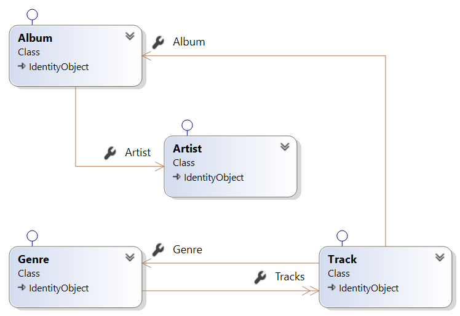

# MusicStore
Das Projekt 'MusicStore' ist ein kleines datenzentriertes Anwendungsbeispiel mit welchem die Erstellung eines Software-Systems dargestellt werden soll. Aufgrund der Komplexität, die ein Software-System im Allgemeinem darstellt, ist die Erstellung des Beispiels in mehreren Abschnitten unterteilt. Die Aufteilung ist wie folgt definiert:  

+ **Teil A** bildet die Basis des Systems und wird in den weiteren Ausbaustufen erweitert 
+ **Teil B** ist die Erweiterung von Teil A mit asynchronen Methoden
+ **Teil C** erweitert das System um eine Web-Api (REST-) Schnittstelle
+ **Teil D** ist die Entwicklung eines Adapters, welcher den direkten Zugriff auf die Geschäftslogik oder über einen indirekten Zugriff mit dem Web-Api (REST) abstrahiert.
+ Teil E (in Bearbeitung) fügt eine Mvc-Client zur Anwendung hinzu
+ Teil F (in Bearbeitung) verwendet einen Blazor-Client als Präsentationsschicht
+ Teil G (in Bearbeitung) zeigt wie die gesamte Anwendungsstruktur durch den Einsatz eines Code-Generator unterstützt werden kann

## Das Projekt
Zur Umsetzung des Projektes wird DotNetCore (3.0) als Framework, die Programmiersprache CSharp (C#) und die Entwicklungsumgebung Visual Studio 2019 Community verwendet. Alle Komponenten können kostenlos aus dem Internet heruntergeladen werden.

### Die Projektstruktur
Als Domainname wird 'MusicStore' verwendet und steht für die Gesamtlösung 'MusicStore'. Das Gesamtprojekt wird in Teilprojekte unterteilt wobei jedes bestimmten Lösungen für einen Teilbereich der Gesamtlösung beinhaltet. Als Namenskonvention für solche Projekt gilt die folgende Regel:  

+ [Domainname].[Bereich] => MusicStore.[Bereich]  

Zum Beispiel wird für den Bereich der Schnittstellen der Name 'MusicStore.Contracts' generiert. In diesem Projekt befinden sich alle für die Domäne relevanten Schnittstellen. 
Die Aufteilung, für den Teil A, erfolgt nach der folgenden Struktur:  

|Projekt|Beschreibung|Typ|Abhängigkeit
|---|---|---|---|
|**CommonBase**|In dieser Projekt werden alle Hilfsfunktionen und allgemeine Erweiterungen zusammengefasst. Diese sind unabhängig vom Problembereich und können auch in andere Domän-Projekte verwendet werden.|Library|keine
|**MusicStore.Contracts**|In dieser Projekt werden alle für das System notwendigen Schnittstellen und Enumerationen umgesetzt.|Library|keine
|**MusicStore.Logic**|Dieser Projekt beinhaltet den vollständigen Datenzugriff, die gesamte Geschäftslogik und stellt somit den zentralen Baustein des Systems dar. |Library|CommonBase, MusicStore.Contracts
|**MusicStore.ConApp**|Dieses Projekt ist eine einfache Test-Anwendung zum Kopieren und Ausgeben der Daten. |Console|MusicStore.Contracts, MusicStore.Logic
 
### Die Datenstruktur
Die Datenstruktur ist überschaulich und besteht im wesentlichen aus 4 Komponenten:

|Komponente|Beschreibung|Grösse|Mussfeld|Eindeutig|
|---|---|---|---|---|
|**Artist**|Der Artist interpretiert und komponiert unterschiedlichste Musik-Titeln. Diese werden in einer oder mehreren Sammlung(en) (Album) zusammengefasst.|
|Name|Name und des Artisten|1024|Ja|Ja|
|**Album**|Das Album beinhaltet eine Sammlung von Musik-Titeln (Track) und ist einem Artisten zugeortnet.|||
|Title|Titel des Albums|1024|Ja|Ja|
|ArtistId|Fremdschüssel zum Artisten|int|Ja|Nein|
|**Genre**|Das Genre definiert eine Musikrichtung und dient zur Klassifikation. Diese Information muss einem Musiktitel (Track) zugeordnet sein.|||
|Name|Name vom Genre|256|Ja|Ja|
|**Track**|Der Track definiert einen Musik-Titel und ist einem Album zugeordnet. Über das Album kann der Artist ermittelt werden.|||
|Title|Titel des Musikstückes|1024|Ja|Nein|
|Composer|Komponist des Musikstückes|512|Nein|Nein|
|Bytes|Größe, in Bytes, des Titles|long|Ja|Nein|
|Milliseconds|Zeit des Titles|long|Ja|Nein|
|UnitPrice|Kosten des Titles|double|Ja|Nein|
|GenreId|Fremdschüssel zum Genre|int|Ja|Nein|
|AlbumId|Fremdschüssel zum Album|int|Ja|Nein|
|**Hinweis**|Alle Komponenten haben eine eindeutige Identität (Id)||||
|*|*Natürlich können noch weitere Attribute hinzugefügt werden.*||||

Aus dieser Definition kann ein entsprechendes Objektmodell abgeleitet werden. Dieses Model ist im Projekt 'MusicStore.Logic' definiert 
und befindet sich im Ordner 'Entities/Persistence'. Der Klassendesigner im Visual Studio zeigt folgendes Bild:



Wie aus der Abbildung leicht erkennbar ist, sind für alle Entitäten Schnittstellen (IEntitätname) definiert. Diese Schnittstellen sind im Projekt 
'MusicStore.Contracts' im Ordner 'Persistence' definiert und dienen zur Interaktion mit den Entitäten außerhalb der Bibliothek. Das Model zeigt auch noch eine weitere Schnittstelle mit dem Namen ICopyable mit dem Entitynamen an. Dies bedeutet, dass das Entity aus einem Schnittstellen-Objekt 
Daten übernehmen kann. Die Entitäten sind von der Sichtbarkeit 'internal' und können nicht außerhalb der Bibliothek verwendet werden.

### MusicStore.Contracts
Wie bereits schon erläutert, befinden sich alle öffentlichen Schnittstelle in diesem Projekt. Die Definition der Schnittstellen für die Entities 
befinden sich im Ordner 'Persistence'. In diesem Ordner befinden sich alle Schnittstellen für die Entitäten welche im Projekt 'MusicStore.Logic' definiert sind. Der Klassendesigner zeigt folgendes Model für die Schnittstellen: 

  
 
Zu beachten ist, dass keine Schnittstelle die Navigationseigenschaften der Entitäten modelliert. Das ist sehr wichtig, weil dadurch unbeabsichtigte Fehler entstehen können. Die Erklärung erfolgt im Teil C Web-Api (REST).  

```csharp ({"Type": "FileRef", "File": "Contracts/IIdentifiable.cs", "StartTag": "//MdStart", "EndTag": "//MdEnd" })
namespace MusicStore.Contracts
{
    /// <summary>
    /// Defines the basic properties of identifiable components.
    /// </summary>
    public partial interface IIdentifiable
    {
        /// <summary>
        /// Gets the identity of the component.
        /// </summary>
        int Id { get; }
    }
}
```  
Die Schnittstelle 'Identifyable' definiert eine schreibgeschützte Eigenschaft 'Id'. Diese Eigenschaft kann nur innerhalb des Projektes 'MusicStore.Logic' verändert werden. Diese Schnittstelle bildet die Basis für alle anderen Schnittstellen vom Typ Entity.  

```csharp ({"Type": "FileRef", "File": "Contracts/ICopyable.cs", "StartTag": "//MdStart", "EndTag": "//MdEnd" })
namespace MusicStore.Contracts
{
	/// <summary>
	/// Defines a generalized copying method for all properties defined by the Type T.
	/// </summary>
	/// <typeparam name="T">The type of object to copy.</typeparam>
	public partial interface ICopyable<T>
	{
		void CopyProperties(T other);
	}
}
```  

Im nachfolgenden wird die Schnittstelle 'IAlbum' stellvertretend für alle Entitäten betrachtet.

```csharp ({"Type": "FileRef", "File": "Contracts/Persistence/IAlbum.cs", "StartTag": "//MdStart", "EndTag": "//MdEnd" })
namespace MusicStore.Contracts.Persistence
{
    /// <summary>
    /// Defines all public properties of an album.
    /// </summary>
    public interface IAlbum : IIdentifiable
    {
        /// <summary>
        /// Gets or sets the reference id from an artist.
        /// </summary>
        int ArtistId { get; set; }
        /// <summary>
        /// Gets or sets the title of this instance.
        /// </summary>
        string Title { get; set; }
    }
}
```
Diese Schnittstelle erbt die Schnittstellendefinition von 'IIdentifyable' und ist somit identifizierbar. Weiters ist eine Eigenschaft 'ArtistId' 
definiert. Diese Eigenschaft beinhaltet die Referenzdaten zum Entity 'Artist'. Die Prüfung auf korrekten Inhalt erfolgt im Projekt MusicStore.Logic'.

Im Projekt ist noch eine weiter Schnittstelle definiert. Diese Schnittstelle befindet sich im Ordner 'Client' und stellt den Zugriff auf die Kontroller-Objekt aus dem Projekt 'MusicStore.Logic' dar. Alle Kontroller, im Projekt 'MusicStroe.Logic' implementieren diese Schnittstelle. 

```csharp ({"Type": "FileRef", "File": "Contracts/Client/IControllerAccess.cs", "StartTag": "//MdStart", "EndTag": "//MdEnd" })
using System;
using System.Collections.Generic;

namespace MusicStore.Contracts.Client
{
    /// <summary>
    /// This interface defines the basic properties and basic operations for accessing the controller.
    /// </summary>
    /// <typeparam name="T">Type, which the basic operations relate.</typeparam>
	public partial interface IControllerAccess<T> : IDisposable 
        where T : Contracts.IIdentifiable
    {
        #region Sync-Methods
        /// <summary>
        /// Gets the number of quantity in the collection.
        /// </summary>
        /// <returns>Number of entities in the collection.</returns>
        int Count();
        /// <summary>
        /// Returns all interfaces of the entities in the collection.
        /// </summary>
        /// <returns>All interfaces of the entity collection.</returns>
        IEnumerable<T> GetAll();
        /// <summary>
        /// Returns the element of type T with the identification of id.
        /// </summary>
        /// <param name="id">The identification.</param>
        /// <returns>The element of the type T with the corresponding identification.</returns>
        T GetById(int id);
        /// <summary>
        /// Creates a new element of type T.
        /// </summary>
        /// <returns>The new element.</returns>
        T Create();
        /// <summary>
        /// The entity is being tracked by the context but does not yet exist in the repository. 
        /// </summary>
        /// <param name="entity">The entity which is to be inserted.</param>
        /// <returns>The inserted entity.</returns>
        T Insert(T entity);
        /// <summary>
        /// The entity is being tracked by the context and exists in the repository, and some or all of its property values have been modified.
        /// </summary>
        /// <param name="entity">The entity which is to be updated.</param>
        void Update(T entity);
        /// <summary>
        /// Removes the entity from the repository with the appropriate identity.
        /// </summary>
        /// <param name="id">The identification.</param>
        void Delete(int id);
        /// <summary>
        /// Saves any changes in the underlying persistence.
        /// </summary>
        void SaveChanges();
        #endregion Sync-Methods
    }
}
```  
Die Definition der Schnittstelle ist generisch und für diesen genersischen Parameter können alle Schnittstellen vom Typ 'Identifyable' eingestezt werden. 
Das ist natürlich ein riesen Vorteil weil diese Schnittstelle nur einmal definiert werden muss und für alle Kontroller verwendet werden. Diese Schnittstelle ist von IDisposable abgeleitet. Damit wird folgende Regel in Betracht gezogen. Alle Komponenten, welche eine Ressource beinhalten oder beinhalten könnten müssen diese Schnittstelle implementieren. Aus dieser Regel ergibt sich, dass alle Objekte, welche diese Schnittstelle implementieren, mit dem Schlüsselwort 'using' verwendet werden müssen. Nachdem ein Kontroller einen 'DbContext' binhalten kann, muss dieser ebenfalls wieder freigegeben werden. 

### MusicStore.Logic
Dieses Projekt nimmt eine zentrale Stellung in dieser System-Architektur ein. Die gesamte Geschäftslogik ist in diesem Projekt implementiert. Aus diesem Grund müssen Änderungen in diesem Projekt mit besonderer Sorgfalt durchgeführt werden. Es gilt folgende Regel:  

**KEIN OBJEKT DARF DIESE SCHICHT VERLASSEN - NUR SCHNITTSTELLEN!**  

Aus diesem Grund gibt es eine einzige Klasse die nach außen sichtbar ist. Diese Klasse heißt 'Factory' und beinhaltet die Fabrik-Methoden, welche die Objekt intanziieren und deren Schnittstellen nach außen leiten. Im nachfolgenden - der Code - für die generische Erzeuger-Fabrik-Methode:

```csharp ({"Type": "FileRef", "File": "Logic/Factory.cs", "StartTag": "//MdStart", "EndTag": "//MdEnd" })
using System;
using MusicStore.Contracts.Client;

namespace MusicStore.Logic
{
	public static class Factory
    {
        public enum PersistenceType
        {
            Db,
            Csv,
            Ser,
        }
        public static PersistenceType Persistence { get; set; } = Factory.PersistenceType.Csv;

        private static DataContext.IContext CreateContext()
        {
            DataContext.IContext result = null;

            if (Persistence == PersistenceType.Csv)
            {
                result = new DataContext.Csv.CsvMusicStoreContext();
            }
            else if (Persistence == PersistenceType.Db)
            {
                result = new DataContext.Db.DbMusicStoreContext();
            }
            else if (Persistence == PersistenceType.Ser)
            {
                result = new DataContext.Ser.SerMusicStoreContext();
            }
            return result;
        }

        public static IControllerAccess<T> Create<T>() where T : Contracts.IIdentifiable
        {
            IControllerAccess<T> result = null;

            if (typeof(T) == typeof(Contracts.Persistence.IGenre))
            {
                result = (IControllerAccess<T>)CreateGenreController();
            }
            else if (typeof(T) == typeof(Contracts.Persistence.IArtist))
            {
                result = (IControllerAccess<T>)CreateArtistController();
            }
            else if (typeof(T) == typeof(Contracts.Persistence.IAlbum))
            {
                result = (IControllerAccess<T>)CreateAlbumController();
            }
            else if (typeof(T) == typeof(Contracts.Persistence.ITrack))
            {
                result = (IControllerAccess<T>)CreateTrackController();
            }
            return result;
        }
        public static IControllerAccess<T> Create<T>(object sharedController) where T : Contracts.IIdentifiable
        {
            IControllerAccess<T> result = null;

            if (typeof(T) == typeof(Contracts.Persistence.IGenre))
            {
                result = (IControllerAccess<T>)CreateGenreController(sharedController);
            }
            else if (typeof(T) == typeof(Contracts.Persistence.IArtist))
            {
                result = (IControllerAccess<T>)CreateArtistController(sharedController);
            }
            else if (typeof(T) == typeof(Contracts.Persistence.IAlbum))
            {
                result = (IControllerAccess<T>)CreateAlbumController(sharedController);
            }
            else if (typeof(T) == typeof(Contracts.Persistence.ITrack))
            {
                result = (IControllerAccess<T>)CreateTrackController(sharedController);
            }
            return result;
        }

        public static IControllerAccess<Contracts.Persistence.IGenre> CreateGenreController()
        {
            return new Controllers.Persistence.GenreController(CreateContext());
        }
		public static IControllerAccess<Contracts.Persistence.IGenre> CreateGenreController(object sharedController)
		{
			if (sharedController == null)
				throw new ArgumentNullException(nameof(sharedController));

			Controllers.ControllerObject controller = (Controllers.ControllerObject)sharedController;

			return new Controllers.Persistence.GenreController(controller);
		}

		public static IControllerAccess<Contracts.Persistence.IArtist> CreateArtistController()
		{
			return new Controllers.Persistence.ArtistController(CreateContext());
		}
		public static IControllerAccess<Contracts.Persistence.IArtist> CreateArtistController(object sharedController)
		{
			if (sharedController == null)
				throw new ArgumentNullException(nameof(sharedController));

			Controllers.ControllerObject controller = (Controllers.ControllerObject)sharedController;

			return new Controllers.Persistence.ArtistController(controller);
		}

        public static IControllerAccess<Contracts.Persistence.IAlbum> CreateAlbumController()
        {
            return new Controllers.Persistence.AlbumController(CreateContext());
        }
        public static IControllerAccess<Contracts.Persistence.IAlbum> CreateAlbumController(object sharedController)
        {
            if (sharedController == null)
                throw new ArgumentNullException(nameof(sharedController));

            Controllers.ControllerObject controller = (Controllers.ControllerObject)sharedController;

            return new Controllers.Persistence.AlbumController(controller);
        }

        public static IControllerAccess<Contracts.Persistence.ITrack> CreateTrackController()
        {
            return new Controllers.Persistence.TrackController(CreateContext());
        }
        public static IControllerAccess<Contracts.Persistence.ITrack> CreateTrackController(object sharedController)
        {
            if (sharedController == null)
                throw new ArgumentNullException(nameof(sharedController));

            Controllers.ControllerObject controller = (Controllers.ControllerObject)sharedController;

            return new Controllers.Persistence.TrackController(controller);
        }
    }
}
```  
<center>Viel Spaß beim Erstellen!</center>

